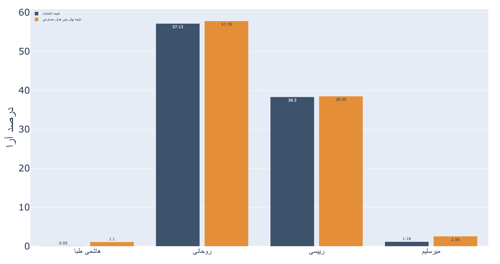
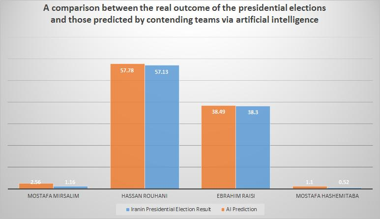

# NLPContest

[NLPContest](http://nlpcontest.com/) was an international AI cooperation and competition with more than 300 contestants, held in Iran in May 2017, regarding the 12th Iran’s Presidential Election. The final result could predict each candidate’s votes percentage with an accuracy of 99.9983%.

| Predicted | Actual | Mean Absolute Error | Accuracy |
|-----------|--------|---------------------|----------|
| [38.49, 57.78, 2.56, 1.10] | [38.28, 57.14, 1.16, 0.52] | 0.7 | 99.9983% |

<!--  -->
<!--  -->

## Dataset
This dataset is made available by [NetMine Knowledge Engine](https://netmine.net/). We release the dataset to help the Persian Data Science, Machine Learning, and AI communities grow. We kindly ask that NetMine is mentioned if used or referenced.

### Dataset Description

The dataset contains nearly 2 million Persian messages related to the 12th Iran presidential candidates, gathered from TeleMine search engine.

### Usage

The dataset is free and open-source and can be used for research and educational purposes.
